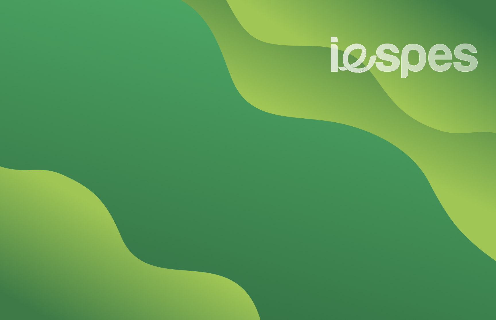

[previous]: https://github.com/dreisss/iespes-extra

# [**_`Iespes Extra: Design`_**](#iespes-extra-design)

Design projects made to use in the computer labs:

- [**_`Logos`_**](./logos/) | Iespes logos made to use in the github repos

  
  &nbsp; | &nbsp;
  
  &nbsp; | &nbsp;
  

- [**_`Wallpapers`_**](./wallpapers/) | Wallpaper to be used in the computer labs

  
  &nbsp; | &nbsp;
  

[**_`❰ Return to previous page`_**][previous]

