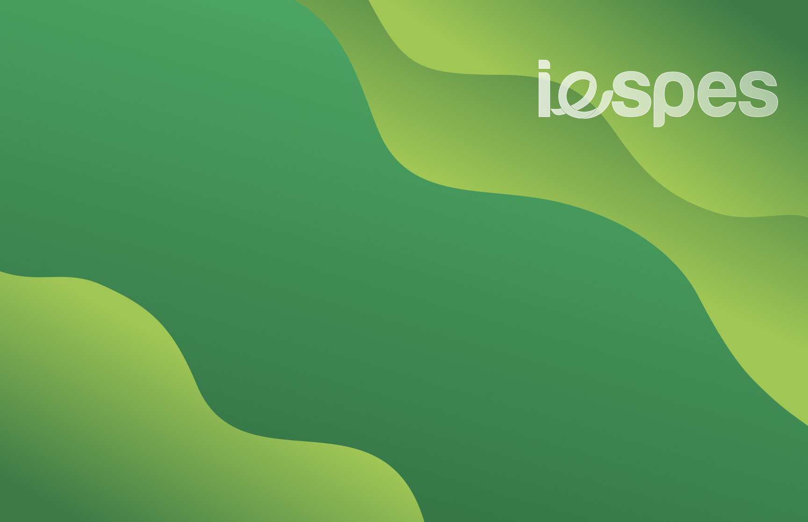

[iespes]: https://www.iespes.com.br "Instituto Esperança de Ensino Superior"

[][iespes]

### Design

Design projects made to use in the computer labs:

- [**_`Logos`_**](./logos/) | Iespes logos made to use in the github repos

  
  &nbsp; | &nbsp;
  
  &nbsp; | &nbsp;
  

- [**_`Wallpapers`_**](./wallpapers/) | Wallpaper to be used in the computer labs

  
  &nbsp; | &nbsp;
  
